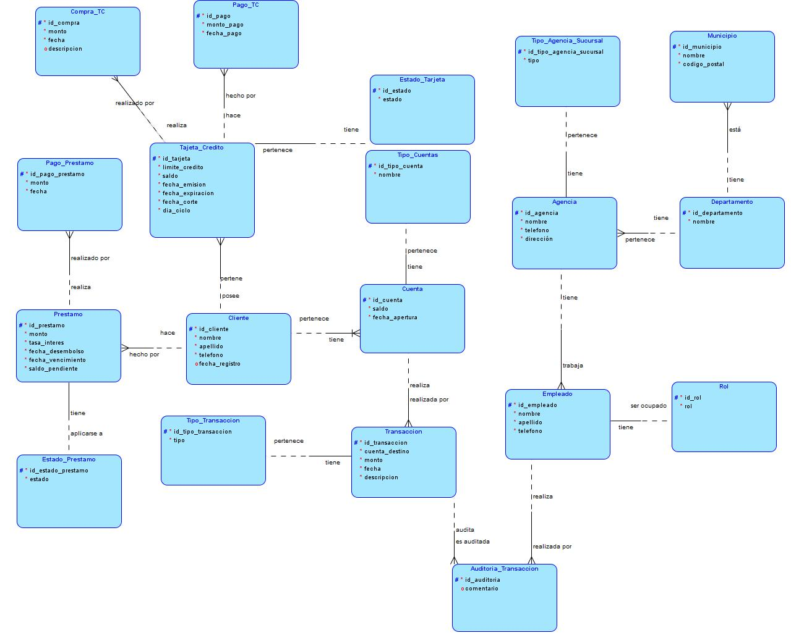
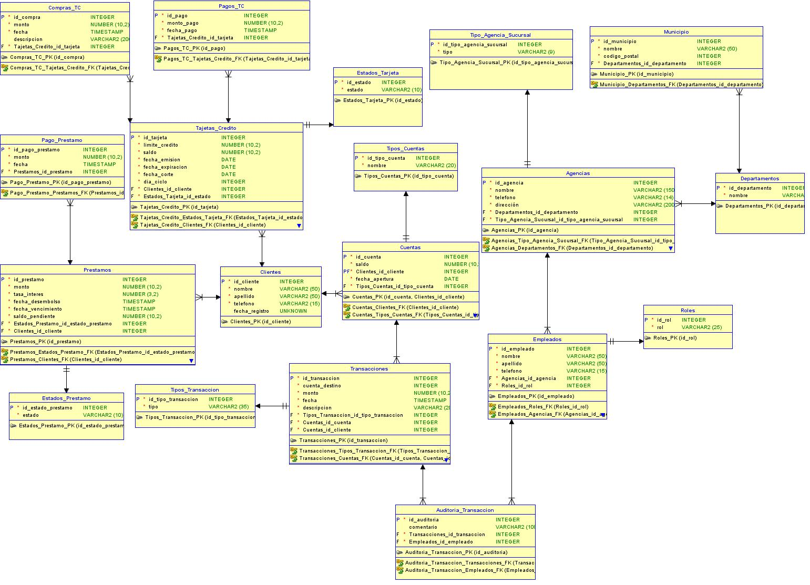

<h1 align="center">Proyecto 1</h1>

🙍‍♂️ Joab Israel Ajsivinac Ajsivinac 🆔 202200135

📕 SISTEMAS DE BASES DE DATOS 1

 🏛 Universidad San Carlos de Guatemala

 📆 Segundo Semestre 2024

# ⚽ Objetivos

### Objetivo General
El propósito principal del proyecto es que los estudiantes adquieran experiencia en el diseño y manejo de bases de datos SQL dentro de un entorno bancario, desarrollando competencias clave como la normalización, la gestión de transacciones, la creación de consultas avanzadas y la optimización para el manejo eficiente de grandes volúmenes de datos en un entorno de producción.

### Objetivos Específicos
1. **Diseño de Base de Datos:** El estudiante debe crear una base de datos completamente normalizada que refleje las operaciones de un banco real.
2. **Gestión de Transacciones:** Desarrollar la habilidad para gestionar transacciones bancarias de manera segura y eficiente, garantizando la integridad de los datos.
3. **Consultas SQL Avanzadas:** Capacitar a los estudiantes para escribir consultas complejas que involucren múltiples tablas, manejo de fechas, agregaciones y optimización de rendimiento.
4. **Soporte de Cargas Simultáneas:** Diseñar y validar el sistema para que soporte múltiples operaciones simultáneas, asegurando la integridad de los datos y un rendimiento óptimo.
5. **Seguridad de Datos:** Implementar mecanismos robustos de seguridad, incluyendo controles de acceso a la base de datos y gestión segura de transacciones.
6. **Modelado de Base de Datos:** Aplicar las mejores prácticas de modelado de datos en la creación de bases de datos transaccionales, asegurando la integridad referencial y la optimización de consultas.

## ⚙ Tecnologías Utilizadas

  

<ul>
  <li>Oracle SQL Developer Data Modeler</li>
  <li>DataGrip</li>
  <li>Docker</li>
  <li>GitHub</li>
  </ul>
</ul>

## 🧮 Identificación de Entidades y Atributos

### 1. **Agencia**

| Atributo                                         | Descripción                                                 |
| ------------------------------------------------ | ----------------------------------------------------------- |
| `id_agencia`                                     | Identificador único de la agencia.                          |
| `nombre`                                         | Nombre de la agencia.                                       |
| `telefono`                                       | Número de teléfono de la agencia.                           |
| `dirección`                                      | Dirección física de la agencia.                             |

🔹 **Por qué existe esta entidad:**
Las agencias son puntos de atención al cliente donde se gestionan servicios bancarios. Es fundamental para organizar y clasificar las sucursales según su tipo y ubicación.

---

### 2. **Auditoría de Transacción**

| Atributo                       | Descripción                                            |
| ------------------------------ | ------------------------------------------------------ |
| `id_auditoria`                 | Identificador único de la auditoría.                   |
| `comentario`                   | Comentarios adicionales sobre la transacción auditada. |

🔹 **Por qué existe esta entidad:**
La auditoría de transacciones es esencial para la transparencia y la prevención de fraudes, permitiendo un control y seguimiento de las operaciones realizadas.

---

### 3. **Cliente**

| Atributo         | Descripción                                        |
| ---------------- | -------------------------------------------------- |
| `id_cliente`     | Identificador único del cliente.                   |
| `nombre`         | Nombre del cliente.                                |
| `apellido`       | Apellido del cliente.                              |
| `telefono`       | Número de teléfono del cliente.                    |
| `fecha_registro` | Fecha en que se registró el cliente en el sistema. |

🔹 **Por qué existe esta entidad:**
Los clientes son el centro del negocio bancario. Esta entidad permite gestionar la información relevante para ofrecer servicios personalizados y efectivos.

---

### 4. **Compra con Tarjeta de Crédito**

| Atributo                     | Descripción                                       |
| ---------------------------- | ------------------------------------------------- |
| `id_compra`                  | Identificador único de la compra.                 |
| `monto`                      | Monto de la compra realizada.                     |
| `fecha`                      | Fecha y hora de la compra.                        |
| `descripcion`                | Detalle de la compra.                             |

🔹 **Por qué existe esta entidad:**
Las compras con tarjeta de crédito son transacciones comunes que deben ser registradas para un mejor seguimiento del gasto de los clientes y el control de las cuentas.

---

### 5. **Cuenta**

| Atributo                       | Descripción                                         |
| ------------------------------ | --------------------------------------------------- |
| `id_cuenta`                    | Identificador único de la cuenta.                   |
| `saldo`                        | Monto total disponible en la cuenta.                |
| `fecha_apertura`               | Fecha en que se abrió la cuenta.                    |

🔹 **Por qué existe esta entidad:**
Las cuentas son esenciales para el funcionamiento de cualquier banco, ya que permiten gestionar los fondos de los clientes y las transacciones que realicen.

---

### 6. **Departamento**

| Atributo          | Descripción                           |
| ----------------- | ------------------------------------- |
| `id_departamento` | Identificador único del departamento. |
| `nombre`          | Nombre del departamento.              |

🔹 **Por qué existe esta entidad:**
Los departamentos permiten organizar el banco en diferentes áreas funcionales, facilitando la gestión y la especialización del personal.

---

### 7. **Empleado**

| Atributo              | Descripción                                            |
| --------------------- | ------------------------------------------------------ |
| `id_empleado`         | Identificador único del empleado.                      |
| `nombre`              | Nombre del empleado.                                   |
| `apellido`            | Apellido del empleado.                                 |
| `telefono`            | Número de teléfono del empleado.                       |

🔹 **Por qué existe esta entidad:**
Los empleados son los encargados de atender y gestionar las necesidades de los clientes, siendo un elemento clave para el éxito del banco.

---

### 8. **Estado de Préstamo**

| Atributo             | Descripción                                                 |
| -------------------- | ----------------------------------------------------------- |
| `id_estado_prestamo` | Identificador único del estado del préstamo.                |
| `estado`             | Descripción del estado del préstamo (activo, pagado, etc.). |

🔹 **Por qué existe esta entidad:**
Los estados de préstamo permiten clasificar los diferentes tipos de préstamos según su situación, facilitando la gestión y seguimiento de cada uno.

---

### 9. **Estado de Tarjeta**

| Atributo    | Descripción                                                     |
| ----------- | --------------------------------------------------------------- |
| `id_estado` | Identificador único del estado de la tarjeta.                   |
| `estado`    | Descripción del estado de la tarjeta (activa, bloqueada, etc.). |

🔹 **Por qué existe esta entidad:**
El estado de las tarjetas es fundamental para el control y la seguridad, permitiendo identificar tarjetas que no se deben utilizar.

---

### 10. **Municipio**

| Atributo                        | Descripción                                                   |
| ------------------------------- | ------------------------------------------------------------- |
| `id_municipio`                  | Identificador único del municipio.                            |
| `nombre`                        | Nombre del municipio.                                         |
| `codigo_postal`                 | Código postal del municipio.                                  |

🔹 **Por qué existe esta entidad:**
Los municipios permiten gestionar la ubicación geográfica de los clientes y agencias, lo cual es clave para brindar servicios locales adecuados.

---

### 11. **Pago de Préstamo**

| Atributo                | Descripción                          |
| ----------------------- | ------------------------------------ |
| `id_pago_prestamo`      | Identificador único del pago.        |
| `monto`                 | Monto pagado en la transacción.      |
| `fecha`                 | Fecha y hora del pago realizado.     |

🔹 **Por qué existe esta entidad:**
Los pagos de préstamos son cruciales para rastrear los ingresos del banco y el cumplimiento de los clientes con sus obligaciones financieras.

---

### 12. **Pago con Tarjeta de Crédito**

| Atributo                     | Descripción                                         |
| ---------------------------- | --------------------------------------------------- |
| `id_pago`                    | Identificador único del pago.                       |
| `monto_pago`                 | Monto del pago realizado con tarjeta.               |
| `fecha_pago`                 | Fecha y hora en que se realizó el pago.             |

🔹 **Por qué existe esta entidad:**
Los pagos con tarjeta de crédito son esenciales para controlar los saldos de las tarjetas y asegurar el pago puntual de las deudas de los clientes.

---

### 13. **Préstamo**

| Atributo                              | Descripción                                         |
| ------------------------------------- | --------------------------------------------------- |
| `id_prestamo`                         | Identificador único del préstamo.                   |
| `monto`                               | Monto total del préstamo.                           |
| `tasa_interes`                        | Tasa de interés aplicada al préstamo.               |
| `fecha_desembolso`                    | Fecha en que se desembolsó el préstamo.             |
| `fecha_vencimiento`                   | Fecha límite para el pago del préstamo.             |
| `saldo_pendiente`                     | Monto que aún debe ser pagado del préstamo.         |

🔹 **Por qué existe esta entidad:**
Los préstamos son productos financieros clave que permiten a los clientes acceder a fondos, generando ingresos para el banco a través de intereses.

---

### 14. **Rol**

| Atributo | Descripción                                  |
| -------- | -------------------------------------------- |
| `id_rol` | Identificador único del rol.                 |
| `rol`    | Descripción del rol |

🔹 **Por qué existe esta entidad:**
Los roles permiten definir las funciones y responsabilidades de cada empleado dentro del banco, facilitando la organización y la gestión del personal.

---

### 15. **Tarjeta de Crédito**

| Atributo         | Descripción                                       |
| ---------------- | ------------------------------------------------- |
| `id_tarjeta`     | Identificador único de la tarjeta.                |
| `limite_credito` | Límite máximo de crédito permitido en la tarjeta. |
| `saldo`          | Monto disponible en la tarjeta.                   |
| `fecha_emision`   |                        | Fecha de emisión de la tarjeta.                           |
| `fecha_expiracion`                     | Fecha de expiración de la tarjeta.                        |
| `fecha_corte`                          | Fecha de corte para el estado de cuenta.                  |
| `dia_ciclo`                            | Día del mes en que se cierra el ciclo de facturación.     |

🔹 **Por qué existe esta entidad:**
Las tarjetas de crédito son herramientas financieras que permiten a los clientes realizar compras a crédito, siendo esenciales para la operativa bancaria.

---

### 16. **Tipo de Agencia Sucursal**

| Atributo                   | Descripción                               |
| -------------------------- | ----------------------------------------- |
| `id_tipo_agencia_sucursal` | Identificador único del tipo de agencia.  |
| `tipo`                     | Descripción del tipo (sucursal, agencia). |

🔹 **Por qué existe esta entidad:**
Clasificar las agencias según su tipo ayuda a entender mejor la estructura del banco y a gestionar adecuadamente los recursos y servicios ofrecidos.

---

### 17. **Tipo de Cuentas**

| Atributo         | Descripción                                           |
| ---------------- | ----------------------------------------------------- |
| `id_tipo_cuenta` | Identificador único del tipo de cuenta.               |
| `nombre`         | Nombre del tipo de cuenta (ahorros, corriente, etc.). |

🔹 **Por qué existe esta entidad:**
Diferenciar entre tipos de cuentas permite ofrecer productos financieros variados que se adapten a las necesidades de diferentes clientes.

---

### 18. **Tipo de Transacción**

| Atributo              | Descripción                                                   |
| --------------------- | ------------------------------------------------------------- |
| `id_tipo_transaccion` | Identificador único del tipo de transacción.                  |
| `tipo`                | Descripción del tipo de transacción  |

🔹 **Por qué existe esta entidad:**
Clasificar las transacciones permite un mejor análisis de las operaciones, facilitando la auditoría y el control financiero.

---

### 19. **Transacción**

| Atributo                                | Descripción                                              |
| --------------------------------------- | -------------------------------------------------------- |
| `id_transaccion`                        | Identificador único de la transacción.                   |
| `cuenta_destino`                        | Identificador de la cuenta de destino de la transacción. |
| `monto`                                 | Monto de dinero involucrado en la transacción.           |
| `fecha`                                 | Fecha en la que se realizó la transacción.               |
| `descripcion`                           | Descripción del intercambio entre las cuentas.           |

🔹 **Por qué existe esta entidad:**
Las transacciones son el registro detallado de todas las operaciones financieras, cruciales para la auditoría y el seguimiento de los movimientos de dinero en el sistema bancario.

# Normalización

<aside>
 No cumple con la primer forma normal (1FN)

</aside>

<aside>
 No cumple con la segunda forma normal (2FN)

</aside>

<aside>
 No cumple con la tercera forma normal (3FN)

</aside>

### Clientes

| ID  | Nombre   | Apellido   |  Número de Cuenta |  Tipo de Cuenta     |  Saldo     | Teléfono       |
| --- | -------- | ---------- | ---------------- | ------------------ | --------- | -------------- |
| 1   | Nombre_1 | Apellido_1 | 70186741-1       | Ahorro             | 256848.49 | +502 4634-7041 |
| 2   | Nombre_2 | Apellido_2 | 42148275-2       | Ahorro             | 378588.21 | +502 2701-1140 |
| 3   | Nombre_3 | Apellido_3 | 95968205-3       | Depósito Monetario | 294799.84 | +502 6277-2079 |
| 4   | Nombre_4 | Apellido_4 | 74601803-4       | Ahorro             | 30357.74  | +502 7371-9552 |
| 5   | Nombre_5 | Apellido_5 | 18184518-5       | Ahorro             | 270027.6  | +502 1699-8122 |

### Clientes

| ID  | Nombre   | Apellido   | Teléfono       | Id_cuenta |
| --- | -------- | ---------- | -------------- | --------- |
| 1   | Nombre_1 | Apellido_1 | +502 4634-7041 | 1         |
| 2   | Nombre_2 | Apellido_2 | +502 2701-1140 | 2         |
| 3   | Nombre_3 | Apellido_3 | +502 6277-2079 | 3         |
| 4   | Nombre_4 | Apellido_4 | +502 7371-9552 | 4         |
| 5   | Nombre_5 | Apellido_5 | +502 1699-8122 | 5         |

### Cuentas

| ID  | Número de Cuenta | ID Tipo de Cuenta | Saldo     |
| --- | ---------------- | ----------------- | --------- |
| 1   | 70186741-1       | 1                 | 256848.49 |
| 2   | 42148275-2       | 1                 | 378588.21 |
| 3   | 95968205-3       | 2                 | 294799.84 |
| 4   | 74601803-4       | 1                 | 30357.74  |
| 5   | 18184518-5       | 1                 | 270027.6  |

### Tipo de cuenta

| ID  | Tipo de Cuenta |
| --- | -------------- |
| 1   | Ahorro         |
| 2   | Monetario      |

## 🧠 Modelo Conceptual

## Modelo Lógico

